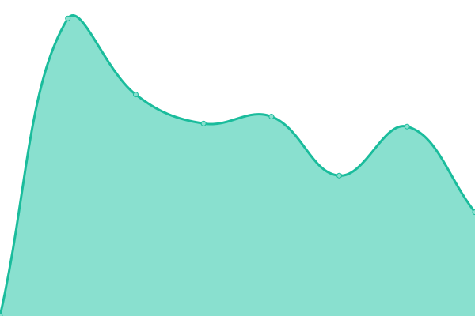

# [📈 Live Status](https://Donald-Nobel.github.io/Uptime): <!--live status--> **🟧 Partial outage**

This repository contains the open-source uptime monitor and status page for [dChief](www.dforce.network), powered by [Upptime](https://github.com/upptime/upptime).

With [Upptime](https://upptime.js.org), you can get your own unlimited and free uptime monitor and status page, powered entirely by a GitHub repository. We use [Issues](https://github.com/Donald-Nobel/Uptime/issues) as incident reports, [Actions](https://github.com/Donald-Nobel/Uptime/actions) as uptime monitors, and [Pages](https://Donald-Nobel.github.io/Uptime) for the status page.

<!--start: status pages-->
<!-- This summary is generated by Upptime (https://github.com/upptime/upptime) -->
<!-- Do not edit this manually, your changes will be overwritten -->
<!-- prettier-ignore -->
| URL | Status | History | Response Time | Uptime |
| --- | ------ | ------- | ------------- | ------ |
|  [dForce](https://app.dforce.network) | 🟩 Up | [d-force.yml](https://github.com/Donald-Nobel/Uptime/commits/HEAD/history/d-force.yml) | 

 871ms
     
 | 

<a href="https://Donald-Nobel.github.io/Uptime/history/d-force">100.00%</a>
    

|  [Baidu](https://www.baidu.com) | 🟥 Down | [baidu.yml](https://github.com/Donald-Nobel/Uptime/commits/HEAD/history/baidu.yml) | 

 2307ms
     
 | 

<a href="https://Donald-Nobel.github.io/Uptime/history/baidu">99.30%</a>
    

<!--end: status pages-->

[**Visit our status website →**](https://Donald-Nobel.github.io/Uptime)

## 📄 License

- Powered by: [Upptime](https://github.com/upptime/upptime)
- Code: [MIT](./LICENSE) © [dChief](www.dforce.network)
- Data in the `./history` directory: [Open Database License](https://opendatacommons.org/licenses/odbl/1-0/)
